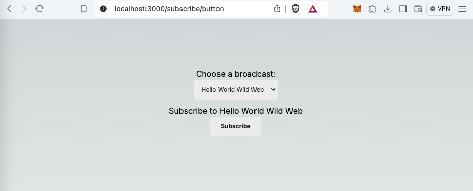

# Set up an example subscribe-broadcast web page

This repo provides an example subscribe-broadcast web page that demonstrates an implementation of a Subscribe button with [built-in user consent](https://docs.xmtp.org/consent/subscribe) provided by XMTP.

Follow these steps to set up an example subscribe-broadcast page like the one [deployed here](https://subscribe-broadcast.vercel.app/subscribe/button) and connected to the XMTP `dev` network.

To get the most out of this repo, use it with the [broadcast-example-api repo](https://github.com/xmtp/broadcast-example-api). The broadcast-example-api repo provides an example broadcast API that you can use with the example subscribe-broadcast page to send broadcast messages and provide broadcast statuses. To learn how, see [Try the subscribe with built-in consent and broadcast flow](https://docs.xmtp.org/consent/subscribe-broadcast). 

**Note**: This is a [Next.js](https://nextjs.org/) project bootstrapped with [`create-next-app`](https://github.com/vercel/next.js/tree/canary/packages/create-next-app).

## Install dependencies

```bash
npm install
```

## Get a WalletConnect project ID

If you don’t already have one, generate a WalletConnect AppKit project ID by visiting WalletConnect's project dashboard at `https://cloud.walletconnect.com/`.

You’ll need the project ID in the next step.

## Create .env file

At the root of the `subscribe-broadcast` directory, create a `.env` file with the following contents. Replace `<your WalletConnect project ID>` with your WalletConnect project ID from the previous step.

`NEXT_PUBLIC_API_HOST=http://localhost:6989` is a value based on the **broadcast-example-api** repo.

```
NEXT_PUBLIC_WALLET_CONNECT_ID=<your WalletConnect project ID>
NEXT_PUBLIC_API_HOST=http://localhost:6989
```

## Start the development server

```bash
npm run dev
# or
yarn dev
# or
pnpm dev
# or
bun dev
```

Go to [http://localhost:3000/subscribe/button](http://localhost:3000/subscribe/button) to see the example subscribe-broadcast page running.



You can edit the page by modifying `app/page.tsx`.

To use this subscribe-broadcast page to try out the flow to subscribe to a broadcast with built-in consent, use it with the [broadcast-example-api repo](https://github.com/xmtp/broadcast-example-api).

To learn how, see [Try the subscribe with built-in consent and broadcast flow](https://docs.xmtp.org/consent/subscribe-broadcast). 
